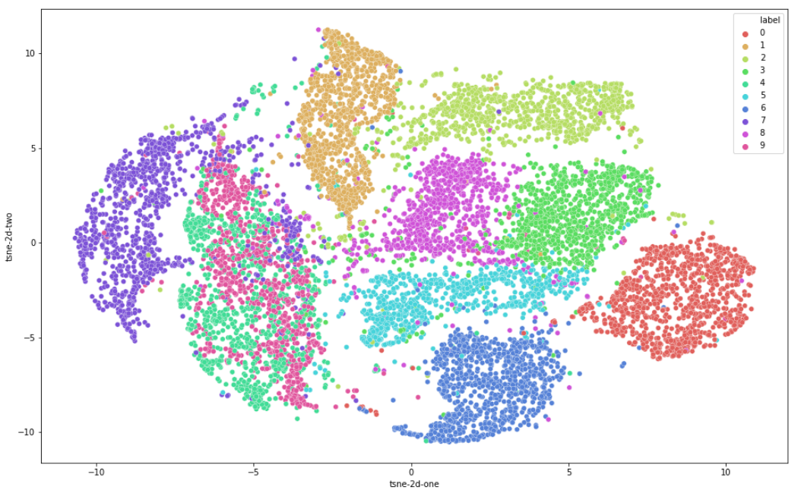

# Dimensionality Reduction
This repository provides _PCA_ and _T-SNE_ algorithms performance comparison on _MNIST_ dataset

# Navigation
- `sklearn.ipynb` contains applications of _scikit-learn_-based _PCA_ and _T-SNE_
- `generate_data_for_tb.py` and `run_tensorboard.sh` scripts launch _tensorboard_ with abovementioned algorithms

# Results
**Dataset**

**2D PCA**

**2D T-SNE**

**3D PCA**

**3D T-SNE**

# Observations
- We see that _T-SNE_ works much better than _PCA_, so one of the reason of such difference is that _T-SNE_ tries to preserve initial data samples distance proportions while _PCA_ just selects _n_ principle components to describe the data;
- But we also see that both methods distinguish `0` and `1` much better than `4` and `9` e.g.

# Sources
- :scroll: [MNIST dataset](http://yann.lecun.com/exdb/mnist/)
- `generate_data_for_tb.py` and `run_tensorboard.sh` scripts launch 
